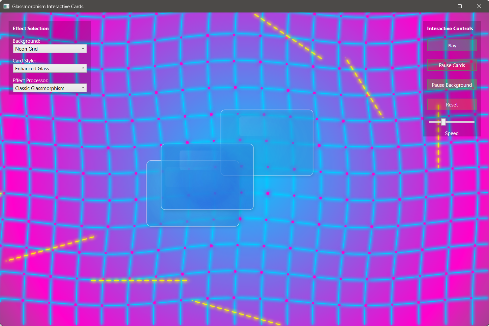
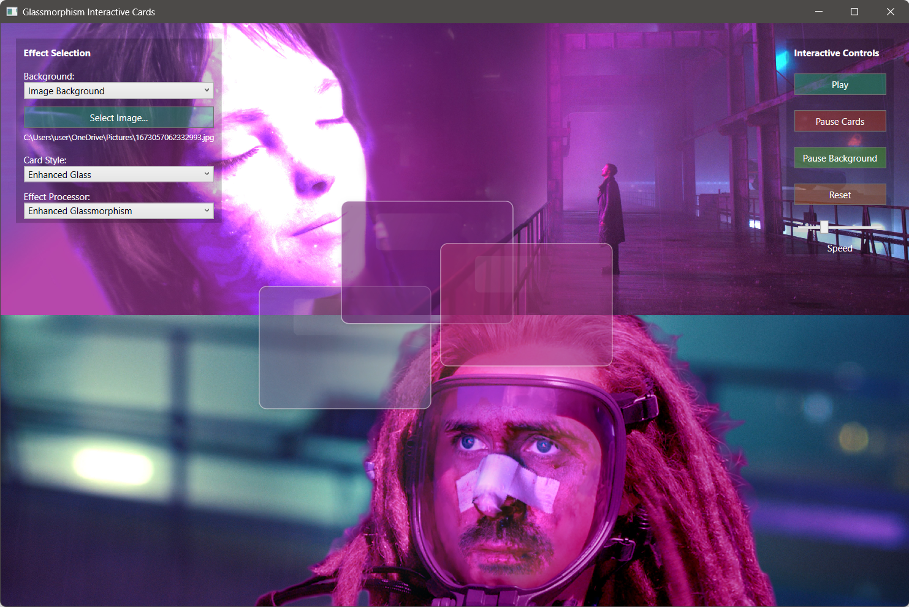
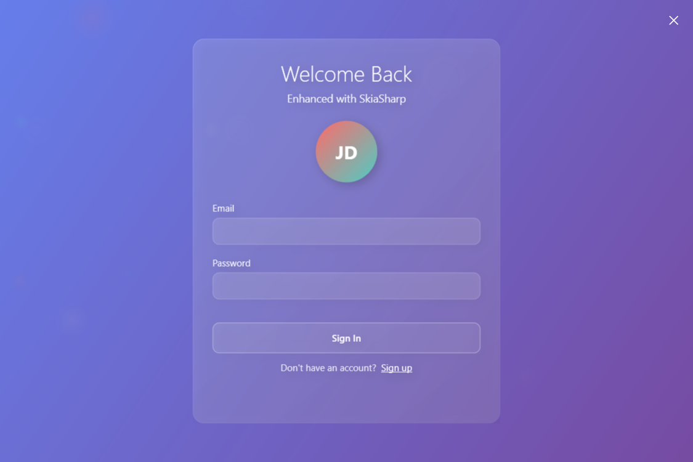
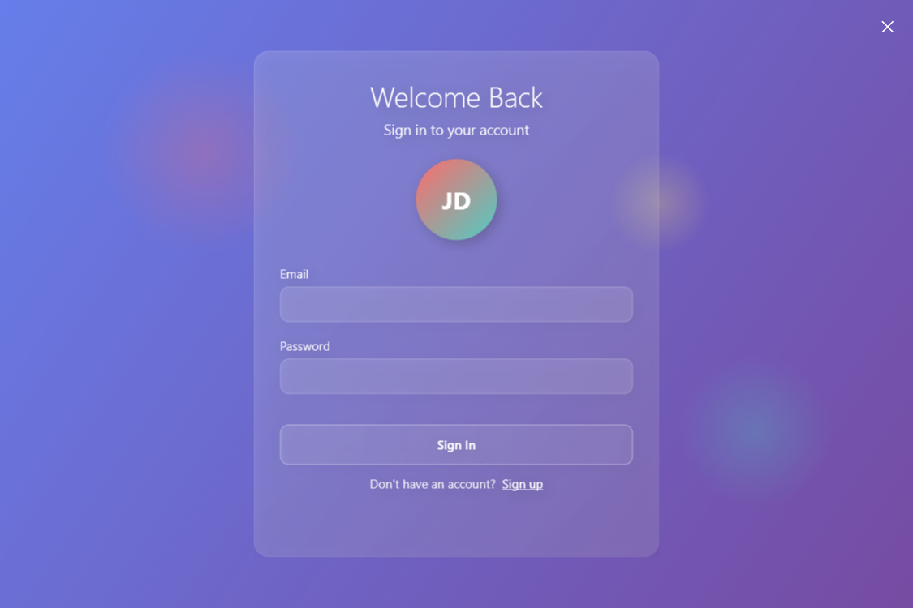

# Glassmorphism in WPF

An exercise in exploring and implementing glassmorphism effects using WPF. Three different approaches demonstrate
various techniques from pure XAML to advanced SkiaSharp rendering, each exploring different aspects of creating
realistic glass effects.



## What is Glassmorphism

Glassmorphism is a design style featuring:

- Semi-transparent backgrounds with blur effects
- Subtle borders and highlights
- Background color bleeding through glass surfaces
- Layered depth with shadow effects
- Interactive transparency that responds to content behind it

## Implementation Approaches

### 1. GlassMorphismInteractive (Advanced SkiaSharp)

**Technique**: Custom rendering with background sampling and real-time effects



**Key Implementation Details:**

- **Background Sampling**: Captures background pixels in real-time to simulate glass refraction
- **Multi-pass Rendering**:
    1. Background rendered to off-screen bitmap
    2. Cards sample background colors at their positions
    3. Glass surface applies blur, transparency, and color blending
    4. Edge highlights and reflections added as final layers
- **Color Bleeding**: Cards influence nearby cards through distance-based color mixing
- **Physics Simulation**: Chromatic aberration, angular dispersion, and refraction effects

**Glass Effect Components:**

- Frosted glass surface with background color sampling
- Dynamic edge highlighting based on lighting
- Animated reflections that move across glass surface
- Shadow casting with blur effects
- Real-time color bleeding between overlapping elements

**Renderers Available:**

- Classic Glass: Traditional frosted glass with subtle blur
- Holographic: Color-shifting iridescent effects
- Neon: Glowing edges with electric-style highlights
- Transparent Glass: Clear glass with background distortion
- Enhanced Glass: Advanced physics-based color bleeding
- Water Drop: Liquid-like surface tension effects

### 2. GlassmorphismSkiaSharp (Basic SkiaSharp)

**Technique**: Direct canvas rendering with fundamental glass effects



**Implementation Focus:**

- Core SkiaSharp painting operations
- Basic blur and transparency without background sampling
- Static gradient backgrounds
- Simple glass card rendering

**Glass Components:**

- Semi-transparent filled rectangles
- Basic blur filters applied to card surfaces
- Gradient overlays for depth
- Simple shadow effects

### 3. GlassmorphismXaml (Pure WPF)

**Technique**: Native WPF effects and visual elements



**Implementation Method:**

- `BlurEffect` applied to background elements
- `OpacityMask` for transparency gradients
- Border elements with `Background` blur simulation
- Visual tree composition without custom rendering

**WPF Effects Used:**

- `BlurEffect` for surface frosting
- `DropShadowEffect` for depth
- `OpacityMask` with gradient brushes
- `Border` elements with rounded corners

## Technical Comparison

| Feature             | Interactive        | SkiaSharp | XAML           |
|---------------------|--------------------|-----------|----------------|
| Background Sampling | ✅ Real-time        | ❌ Static  | ❌ Simulated    |
| Color Bleeding      | ✅ Physics-based    | ❌ None    | ❌ None         |
| Performance         | 🔥 GPU Accelerated | ⚡ Good    | 🐌 CPU Limited |
| Complexity          | 🔴 High            | 🟡 Medium | 🟢 Low         |
| Customization       | 🔥 Full Control    | ⚡ Good    | 🟢 Limited     |

## Running the Projects

```bash
# Main interactive demo
dotnet run --project GlassMorphismInteractive

# Basic SkiaSharp version
dotnet run --project GlassmorphismSkiaSharp

# Pure XAML version
dotnet run --project GlassmorphismXaml
```

## Controls (Interactive Version)

- **Animation Controls**: Play/Pause overall animation or separate card/background animation
- **Speed Control**: Slider to adjust animation speed (0.1x to 3.0x)
- **Background Selection**: Choose from gradient, aurora, neon grid, or custom image
- **Card Style**: Select different glass rendering techniques
- **Effect Processor**: Choose interaction algorithms (Classic vs Enhanced)
- **Reset**: Return cards to original positions

## Requirements

- .NET 8.0
- Windows 10/11
- GPU with DirectX support (recommended for Interactive version)

## Key Learning Points

1. **Background Sampling**: How to capture and sample background content for realistic glass effects
2. **Multi-layer Rendering**: Building complex effects through multiple render passes
3. **Color Theory**: Implementing physically-based color bleeding and refraction
4. **Performance**: Balancing visual quality with real-time rendering requirements
5. **WPF Integration**: Combining custom SkiaSharp rendering with WPF UI controls
